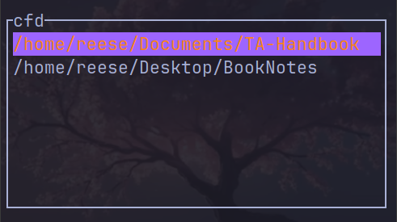

# **cfd**

<p align="center">
  <a href="https://github.com/reesehatfield/">
    
  </a>
</p>

<h3 align="center"><strong>cfd</strong></h3>

<p align="center">
    A nice TUI wrapper for the `code` and `zoxide`
      <br>
</p>


Turns your current shell instance into a VSCode instance. 
Has a nice TUI for multiple options

## Usage
```
cfd [approximate name of directory]
```

## Installation
Prerequisites:
  - `cargo`
  - `zoxide`
  - `code`

```bash
./install.sh
```


